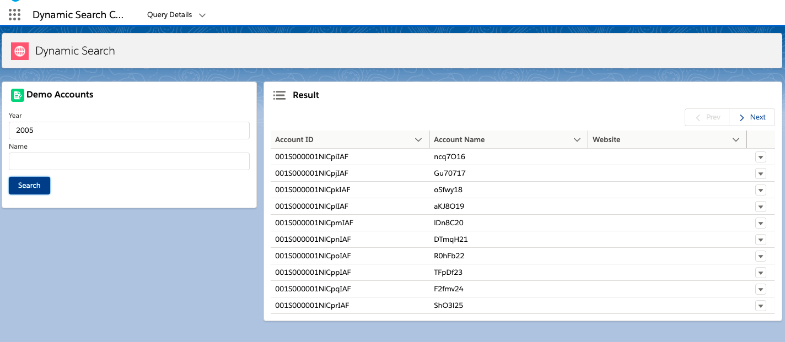

# Salesforce Dynamic Search

Data driven search utility

## Overview

A search utility that allows admins to create search pages, define filter criteria and search results without writing any code.

## Package deployment to a scratch org

1. Create a scratch org

```
sfdx force:org:create -f <scratch org definition json> -a dynamicSearch
```

2. Install the package in a scratch org

```
sfdx force:package:install --package 04t3m000002NPDLAA4 -k BananaMonkey@21 -u dynamicSearch
```

3. Assign permission set to user

```
sfdx force:user:permset:assign --permsetname Dynamic_Search_User --targetusername dynamicSearch
```

## Testing the package in a scratch org

1. Setup test data

You can use the sample Account data available [here](./test/demo-Accounts.json)

```
sfdx force:data:import -p test/demo-Account-plan.json -u dynamicSearch
```

2. Open the scratch org

```
sfdx force:org:open -u dynamicSearch
```

3. Setup search page data

   a. Navigate to 'Dynamic Search Config' from the App Launcher

   

   b. Click 'New' under Query details and setup page data. For example:

   

   c. From Related tab enter Query filter/s

   

   

   d. Navigate to Detail section and click on 'Search Page Link'

   

   e. Search Page

   

## References

[Breaking runtime dependency](https://developer.salesforce.com/blogs/2019/07/breaking-runtime-dependencies-with-dependency-injection.html)

[Apex dependency injection](https://github.com/pozil/apex-dependency-injection)
